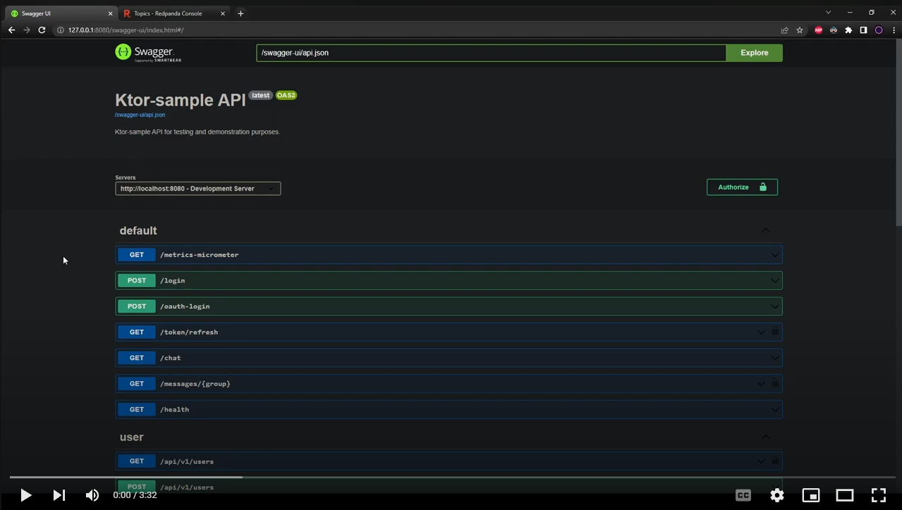
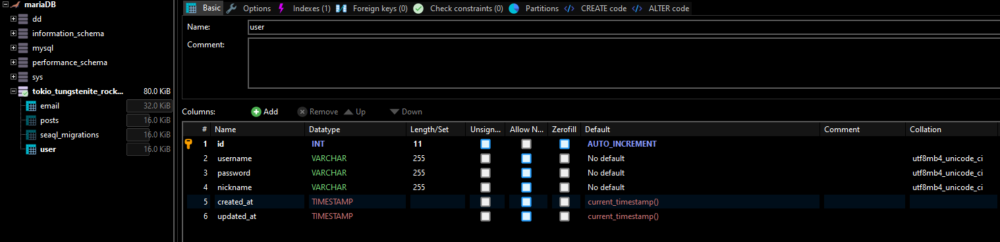
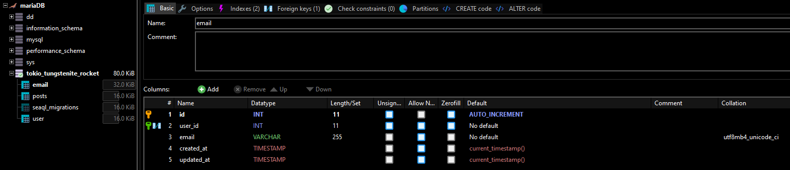
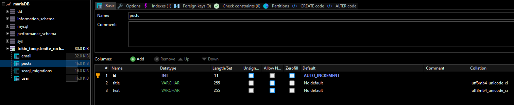

= Ktor web & websocket sample

 Coroutine & Non-blocking

== Tutorial movie

▲ Click the link!

// video::6pRl7A75_-4[youtube]

== Swagger ui (Check out available API here!)

http://121.172.169.213:8000/swagger-ui

 http://121.172.169.213:8000/swagger-ui

... If running on a local server

http://localhost:8000/swagger-ui

 http://localhost:8000/swagger-ui

== Websocket url

 ws://121.172.169.213:8080/socket?{topic name}

. IMPORTANT: PORT IS 8080, NOT 8000

... If running on a local server

 ws://localhost:8080/socket?{topic name}

.. e.g)
 ws://121.172.169.213:8080/socket?food_topic

 ws://121.172.169.213:8080/socket?room1

. Note) Swagger does not support WebSockets

== Kafka topic console

http://121.172.169.213:9080

 http://121.172.169.213:9080

... If running on a local server

http://localhost:9080

 http://localhost:9080

== How to tune

. Modify the `url` var in `api/Rocket.toml` to point to your chosen database and modify .env file too.
.. You don't have to create a matching Database.
. Turn on the appropriate database feature for your chosen db in `service/Cargo.toml` (the `"sqlx-postgres",` line)
. Set aws environmental variables and github actions secrets in `.github/workflows/aws.yml`
. Run kafka server infrastructure using `docker compose up`
. Execute `cargo run` to start the server
. You can go to `http://localhost:8000/swagger-ui/index.html` to see the api documentation about this demo project.
.. Note: WebSocket is binding at port 8080, so you can go to `ws://localhost:8080/socket?{group/topic name}` to connect to the WebSocket about this demo project.

[source,bash]
.docker compose up command
----
docker compose up -d
----

=== Producers and consumers writing and reading events from Kafka topics ( ws://.../socket?{query} )

image::.adoc/images/kafka-producers-consumers-topics.jpg[]

== User table columns

== Email table columns

== Post table columns

== How to use

. Post a user
. Login via /login path to acquire `Authorization` key
. Set `Authorization` key to `Authorization` header
... Don't forget the prefix `Bearer `
... e.g) `Bearer eyJhbGciOiJIU....`
. Now you can access every apis and websocket!

.. Note: websocket url e.g) ws://localhost:8080/socket?{group/topic name}

=== Notice

... You don't need to create a user when connecting to `ws://.../socket?{group}`.
... If you connected with `Authorization` header, the server shows your nickname.

